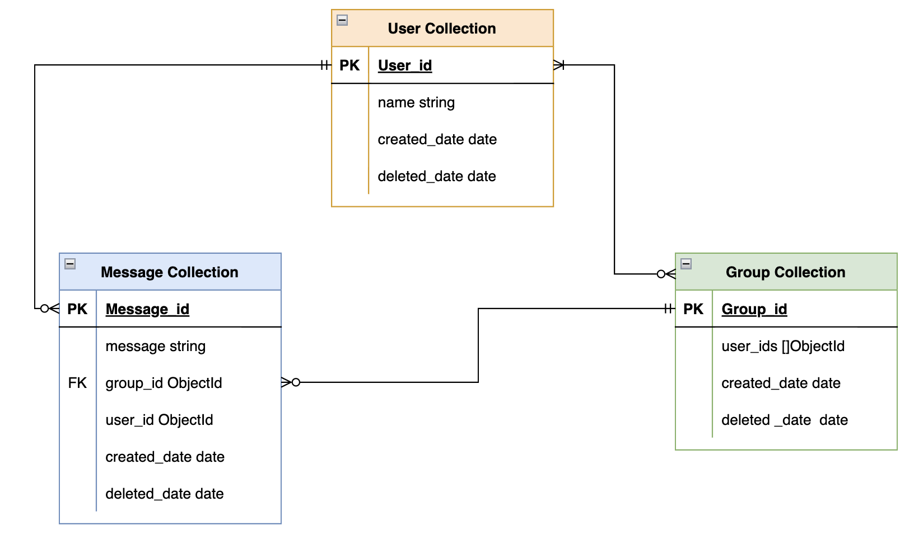

# 💬TikTalk-documentation

## R1: Description of Website

### Purpose

The purpose of our application, TikTalk, is to allow users to communicate with one-another in a fast, efficient manner.

**Functionality/Features**

- Chat history
- User avatars
- File/Image uploads
- Download chat history

**Target Audience**

The TikTalk development team believes in building applications for everyone. Although we firmly believe that anyone can use our application and we aim to make it as accessible as possible, the typical end-user will probably be between the ages of 20 - 40 years old, and have good taste in chat applications. It will be free to use and likely to suit university students, families, colleagues, and friends alike!

**Tech Stack**

- MongoDB
- ExpressJS
- ReactJS
- Node.js
- JSON Web Tokens (Auth)

---

## R2: Dataflow Diagram

### Dataflow diagram

### Sequence Diagram

#### User logon

#### User POST message(authenticated)

### Getting and using JWT

### Renew user JWT

#### Database ERD

---

## R3: Architecture Diagram

### Top level architecture diagram

### Detailed architecture diagram

---

## R4: User Stories

### The first version of user stories

- As a user, I want to be able to register, log in and log out to the app, so that I can see and manage my own group or friends.

- As a user, I want to be able to send messages and receive messages, so that I can chat with my friends.

- As a user, I want to be able to create a group, so that I can chat with multiple friends at the same time.

- As a user, I want to be able to add friends to my groups so that I can chat with multiple friends at the same time.

- As a user, I want to be able to delete a group, so that I can manage group and keep the chat app tidy.

- As a user, I want to be able to leave a group, so that I no longer receive messages from that group.

- As a user, I want to be able to view message history, so that I can find some important information without lose it.

---

## R5: Wireframes

---

## R6: Screenshots of Trello board

### Desktop - Login

### Desktop - Chat page

### Mobile - Login

### Mobile - Chat page

